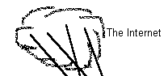

# The Hole in the Wall Daemon
Software for creating controlled leaks in firewall networks

A software construction from an earlier age of the Internet.
From before the coining of the term 'Intranet'.
Coded by Edward C Bennett. 
As told to him by <A HREF="http://davidherron.com">David S Herron</A>

This document created April 5, 1996.

This software created sometime in 1992 or so.

My how time flies and the world changes in such a short time.

Why, in 1992, hardly anybody KNEW of the Internet. &nbsp;Whoda thunk it?

<A HREF="#Introduction">Introduction</A> | <A HREF="#What is HoleD">What is HoleD?</A> | <A HREF="#How does it work">How does it work</A>  <A HREF="#Other possible uses">Other possible uses</A> | <A HREF="#What HoleD cannot do">What HoleD cannot do</A> | <A HREF="#Future Directions">Future Directions</A> <A HREF="#Security considerations">Security considerations</A> | <A HREF="#Downloading the Source">Downloading the Source</A>

## <A NAME=Introduction>Introduction</A>

Firewalls are a necessary and vital thing to have. &nbsp;They limit the exposure your to the world thereby allowing you to feel safer to some degree. &nbsp;As if there were safety anway. &nbsp;In retrospect safety is an illusion for the need to control is simply an indication of ones inner feeling of there being no control. &nbsp;However in the "<I>real world</I>", by the terms and conditions of the societal matrix making up the Internet, it is frequently and understandably desired to have protection and control.

The model for this control in this context is yet another division of the world into pieces. &nbsp;One piece is "<I>out there</I>", or "<I>the 'main' Internet</I>". &nbsp;In pictures of the network this is always drawn as a great large looming cloud. &nbsp;In older computer networking times this large cloud was labeled with terms like "<B>X.25</B>", "<B>DECNET</B>" or "<B>SNA</B>". &nbsp;In these modern times the cloud is labeled "<B>Internet</B>". &nbsp;Same general architecture, with different words and protocols for different times. &nbsp;An analogy to the other "<I>real world</I>" (the world of trees, rivers and oceans we live in) is the ocean itself.

Another piece is an organizationally owned line which is a bridge zone. &nbsp;This bridge zone is an intermediary area in which information is exchanged between the relative safety inside the organization and the raw chaos <I>out there</I>. &nbsp;The bridge zone is like a no mans land, or to use the ocean metaphor, a harbor. &nbsp;Ships come and go from the harbor bringing things, the harbor is where foreigners abound while in the interior of the country the people and places are more uniform protected from the influences of foreign people and events. &nbsp;Likewise those inside the country having business with people outside the country tend to go to the harbor towns to conduct business.

The last piece of the networking model is the interior network.  &nbsp;This can be drawn as a cloud too, but is more likely drawn as a number of interconnected line segments with computers hanging off them. &nbsp;This is the technical infrastructure of your organization. &nbsp;It is the wiring which holds the organization together. &nbsp;It is the bones and blood vessels of the flow of electronically exchanged information within the organization.  &nbsp;This is the place the crown jewels are stored, the information the organization owns and wants to protect from the world. &nbsp;Not just the information, but also the processes which the organization has learned in order to make itself useful to the world. &nbsp;In the ocean/harbor analogy, this is the towns, villages and road network connecting with the harbor towns.  
Like all analogies the ocean/harbor/village one is imperfect.  &nbsp;But you get the idea.

The bridge network is both a protection zone and an exchange zone. &nbsp;It protects from outside incursions while allowing the exchange of information. &nbsp;It does not do for the bridge network to be an absolute wall keeping everything out, as that prevents the exchange which is vital and necessary. &nbsp;Instead the bridge network must allow some information to flow hither and yon.

<A HREF="#top">Return to Top.</A>

## <A NAME="What is HoleD">What is HoleD?</A> 

The <I>Hole in the wall Daemon</I> (<I>HoleD</I> for short) is a controlled hole in the bridge network. &nbsp;It allows for tiny breaches to be created allowing for exchanges. &nbsp;It is a small process intended for a Unix system running the <A HREF="http://www.bsdi.com/">BSD</A> suite of Internet software, and was originally developed on a <A HREF="http://www.sun.com/">Sun/SPARC</A> server running SunOS 4.1, a 4/280 as I recall. &nbsp;The HoleD may not be entirely necessary in this modern age of wide availability of good firewall software. &nbsp;Like it says in the title area, it was constructed in an earlier age. &nbsp;It is, however, of general design and may be useful for other situations than originally intended.

The HoleD is run from <I>inetd</I> and, depending on the address of the incoming connection, will create a bridging connection elsewhere.  &nbsp;It then goes into a loop passing data between them until one closes.&nbsp;&nbsp;That's it. &nbsp;It uses a configuration file to control what incoming ports get connected to which outgoing ports and is otherwise very simple.

This was designed with the following environment. &nbsp;A medium sized software company which we both worked at having a bridge network.  &nbsp;One VMS system was the router conntecting the company to the network, being both the TCP/IP router having all the ethernet and high speed connections, as well as the mail hub between the company and <I>out there</I>. &nbsp;One ethernet/TCP/IP network segment was available in a way such that systems on this network were directly visible to <I>out there</I> with no protection.  &nbsp;And the rest of the company had no access. &nbsp;There were two systems, other than this VMS based mail hub, another (and extremely dumb) router and the above mentioned Sun server (fortuitously owned by Software Engineering for experimentation purposes) which had a second ethernet interface facing the internal network. &nbsp;The Usenet/NNTP server was located on an internal system without visibility to <I>out there</I> and no good solution for bringing articles into it.

Thus we have motivation: &nbsp;Getting Usenet inside the company network!

The extremely dumb router was certainly incapable of bridging this traffic itself, and it was very unlikely to be replaced. &nbsp;Especially for something viewed to be as nonessential as Usenet. &nbsp;Sigh.

So, witness this spectacle. &nbsp;Two former usenet site administrators, one of them a former member of the Usenet Backbone Cabal (er.. Committee), without a good and reliable news feed, and without the technical infrastructure to support the right connections. &nbsp;Fortunately just the right amount of hardware and technical knowhow was available to do the job. &nbsp;Out of this need was the adventure of creating HoleD born.  &nbsp;(Do you think I'll grow up to be a novelist one day? &nbsp;Please give me any feedback on this question as soon as possible.)

<A HREF="#top">Return to Top.</A>

## <A NAME="How does it work">How does it work</A>

Installation is in the olden style of: 1) ponder the source code and Makefile, 2) adjust to local site preferences, 3) compile. &nbsp;You may want to adjust the location of <TT>holed.conf</TT> controlled by a <TT>#define</TT> in <TT>holed.c</TT>, the default is <TT>/etc/holed.conf</TT>. &nbsp;You also may need to adjust the set of <TT>#include</TT>'s in <TT>holed.c</TT> as SunOS 4.1 systems are getting rarer as the days go by, they are correct for SunOS 4.1.

This is an example <TT>/etc/holed.conf</TT> as it was being used by us.

<PRE>
nntp	gonzo.twg.com		gollum.twg.com
nntp	gollum.twg.com		mips.com
nntp	mips.com		gollum.twg.com
nntp	idunno.princeton.edu	gollum.twg.com
nntp-idunno	gollum.twg.com		idunno.princeton.edu	nntp
whois	boomer.twg.com		nic.ddn.mil	whois
</PRE>

The first two columns give way to describe incoming connections. &nbsp;Recall that <TT>holed</TT> is meant to run from <TT>inetd</TT>. &nbsp;When <TT>holed</TT> starts it uses <TT><A HREF="http://www.bsdi.com/bsdi-man?proto=1.0&apropos=0&section=ALL&query=getpeername">getpeername(2)</A></TT> to determine where the connection is coming from. &nbsp;The connection is an IP address and a port number. &nbsp;What is in the file is a protocol name (a lookup in <TT>/etc/services</TT> tells you the port number) and a host name, and <TT>holed</TT> compares the port/host names in the file with the IP/port returned by <TT><A HREF="http://www.bsdi.com/bsdi-man?proto=1.0&apropos=0&section=ALL&query=getpeername">getpeername(2)</A></TT>.

If the incoming connection matches the first two columns of one of these lines then it is bridged to the connection described in the third and optional fourth column.

No specific port number is assigned to <TT>holed</TT> as it does not have its own protocol. &nbsp;Instead one configures <TT><A HREF="http://www.bsdi.com/bsdi-man?proto=1.0&apropos=0&section=ALL&query=inetd">inetd</A></TT> to use <TT>holed</TT> for some of the services offered through <TT>inetd</TT>. &nbsp;In <TT>inetd.conf</TT> there is a place to give the name of the executable that provides the given service. &nbsp;Instead of listing, for instance, <TT>nntpd</TT> to service the <TT>nntp</TT> protocol, we listed <TT>holed</TT> instead.

Given the above configuration file, incoming <TT>nntp</TT> connections are bridged to one of two places, depending on where the connection comes from. &nbsp;The system <TT>gollum.twg.com</TT> was the main news server at this time and so most of the connections would go there. &nbsp;Most especially note the <TT>mips.com</TT> and <TT>idunno.princeton.edu</TT> lines as these are connections from <I>out there</I> which we wished to bridge into the internal network. &nbsp;Likewise <TT>nntp</TT> coming from <TT>gollum.twg.com</TT> was bridged to <TT>mips.com</TT> allowing our outgoing <TT>nntp</TT> traffic to be sent. &nbsp;However the outgoing connection to <TT>idunno.princeton.edu</TT> is handled differently. &nbsp;There wasn't a way to distinguish which host <I>out there</I> to bridge to other than to connect with a different port and have <TT>holed</TT> map the port we numbered <TT>nntp-idunno</TT> to <TT>idunno.princeton.edu:nntp</TT>.

That's it. &nbsp;Simple, eh?

<A HREF="#top">Return to Top.</A>

## <A NAME="Other possible uses">Other possible uses</A>

The above uses are interesting. &nbsp;There are other possible uses which we never tried, but certainly feel are possible.

For instance some services such as Mail and News are expensive and unneccessary to replicate on every server or workstation. &nbsp;Still it is a more simply configured environment if each server and workstation answers to the <TT>NNTP</TT> and <TT>SMTP</TT> ports with a reasonable response.  &nbsp;Responding with a failure notification and closing the connection is less than useful. &nbsp;Instead <TT>holed</TT> can be used on the more simply configured systems to map incoming NNTP/SMTP connections to a more central server system. &nbsp;To do this successfully <TT>holed</TT> might need to have extra abilities to prevent loops in some form. &nbsp;In any case this is only to be considered useful for internal use, not used in bridging to <I>out there</I>.

The <TT>http</TT> protocol, <TT>HTML</TT> markup language, nor any of the other WWW pieces&nbsp;had not been invented yet at the time of creating <TT>holed</TT>. &nbsp;Just as it is applied to <TT>nntp</TT> in the example it can be easily applied to <TT>http</TT>. &nbsp;The configuration file should become more complex giving a way to give wildcards and perhaps to disallow certain addresses.

Maybe you want to offer different <TT>http</TT> servers to different addresses?

The <I>virtual host</I> metaphor that has been created for WWW marketeering efforts can use something like <TT>holed</TT> quite well.  &nbsp;Instead of responding to the external half of the incoming connection it would respond to the internal half of the incoming connection.  &nbsp;Depending on the address being connected TO (as opposed to connected FROM as described above), different addresses to bridge TO would be used.  &nbsp;Given the flexible nature of the <TT>holed</TT> configuration, the destination address can be for different <TT>http</TT> servers on the local system, or across multiple external systems.

Think of <TT>holed</TT> as a <I>symbolic link</I> analogue.  &nbsp;In modern Unix systems the symbolic link is a way to make one thing appear elsewhere for any of a number of reasons.

<A HREF="#top">Return to Top.</A>

## <A NAME="What HoleD cannot do">What HoleD cannot do</A>

The principle limitation is that <TT>holed </TT>does not know anything about the protocols it is bridging. &nbsp;So it cannot be used to bridge protocols that use side connections, such as <TT>ftp</TT>, since <TT>holed</TT> cannot possibly and does not have the context to know to look for the extra connection. &nbsp;<TT>Holed</TT> could be taught the necessary knowledge, but then it becomes an <TT>ftp</TT> bridging daemon, not a generic bridging daemon. &nbsp;Another column would have to be given describing the protocol to emulate/bridge.

<TT>Holed</TT> does not bridge anything other than the data arriving on either side of the TCP connections.

<TT>Holed</TT> only bridges TCP, not UDP nor RDP.

<A HREF="#top">Return to Top.</A>

## <A NAME="Future Directions">Future Directions</A>

At the present moment <TT>holed</TT> is unlikely to be maintained by either Edward Bennett or myself. &nbsp;Neither have the incentive &nbsp;or timeto support this or develop it further. &nbsp;It served our purpose well.

While writing this it occurred to me the following features would be useful additions:
<UL><LI>
A declaration of which half of the incoming connection to match for.
</li>
<LI>
Some options on the TCP socket, such as buffer sizes, passing of OOB data, SO_LINGER, timeouts, and so forth.
</li>
<LI>
Emulation of some protocols that use side ports. &nbsp;FTP in particular.
</li>
<LI>
More complex matching of incoming host names such as wild cards (both for IP address and host name). &nbsp;Also a way to negate certain hosts or wildcarded hosts. &nbsp;List multiple conditions in one line.
</li>
<LI>
Range of port numbers in the incoming connection in addition to just the single port name as now.
</li>
<LI>
Does the newer security protocols have any impact?
</li>
<LI>
Bridging UDP as well.
</li>
<LI>
Nicer looking configuration file with at least commenting
allowed.
</li>
<LI>
A GUI to administer the config file, perhaps as a binary
file instead of ASCII.
</li>
<LI>
A way to randomly select a destination host, to implement
rudimentary load balancing.
</li>
</UL>

<A HREF="#top">Return to Top.</A>

## <A NAME="Security considerations">Security Considerations</A>

This application is a security breach so it is wise to consider for a moment the security considerations.

Just as symbolic links can be used unwisely to create a tangled mess, so could <TT>holed</TT>. &nbsp;So the first reccomendation is to keep <TT>holed</TT> use as simple as possible. &nbsp;It is only one of the many kinds of tools to be used in the well stocked network administrators toolchest.  &nbsp;Use it wisely.

Every breach created by <TT>holed</TT> is created by the person who installed it. &nbsp;Before adding a line to <TT>holed.conf</TT> consider the implications of exporting that protocol to <I>out there</I>. &nbsp;You should&nbsp;understand something about the protocol, and the&nbsp;abilities of the protocol has both desired and undesired. &nbsp;This should be safe as the normal protocols themselves are safe (relatively) enough to be widely used anyway.

<TT>Holed</TT> does not, itself, respond to the data it passes so it does not add any extra breaches. &nbsp;It is simply a pipe through which to crosslink two spots. &nbsp;Kind of like the <I>white holes</I> which are supposed to be associated with <I>black holes</I>.  
The installation should itself be secure. &nbsp;Do not make <TT>holed.conf</TT> publicly writable 'lest an unscrupolous user use it to create real security breaches.

<A HREF="#top">Return to Top.</A>

## <A NAME="Downloading the Source">Downloading the Source</A>

The source code for <TT>holed</TT> is small enough to simply offer directly here. &nbsp;Click on the following links to download
each piece:
<PRE>
<TT><A HREF="holed.c">holed.c</A>		C source code for the program</TT>.
<TT><A HREF="holed.conf">holed.conf</A>	Example configuration file</TT>.
<TT><A HREF="Makefile">Makefile</A>	Instructions for building the program.</TT>
</PRE>

Load each into your browser and use <I>Save As</I> to save to disk.

This software is offered free of charge, with no attempt to assert ownership of any kind nor to aquire any support or money for it. &nbsp;Use it as you will. &nbsp;I simply wanted to document a useful piece of technology.

<A HREF="#top">Return to Top.</A>
